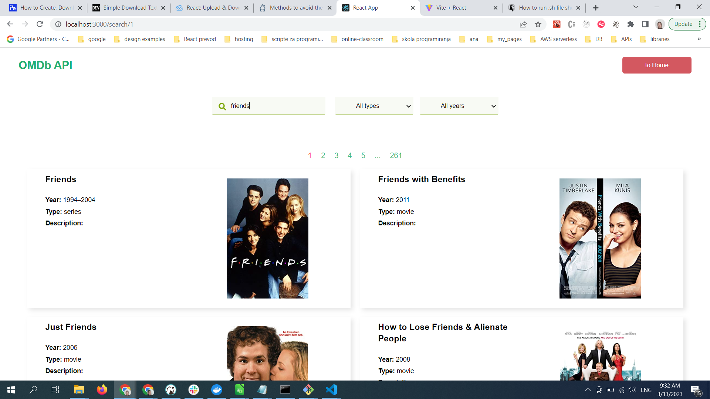
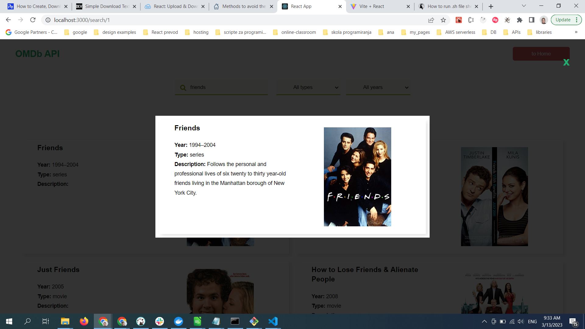
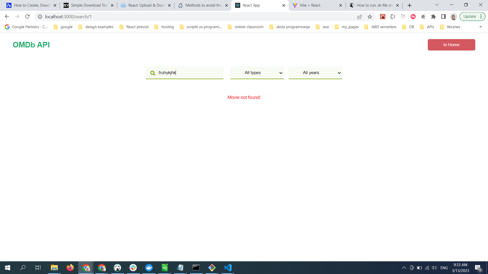
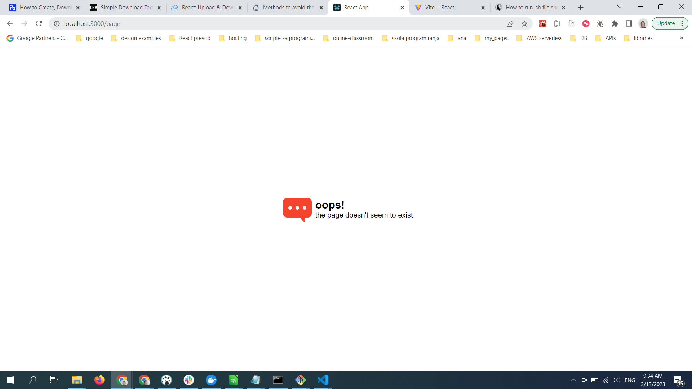
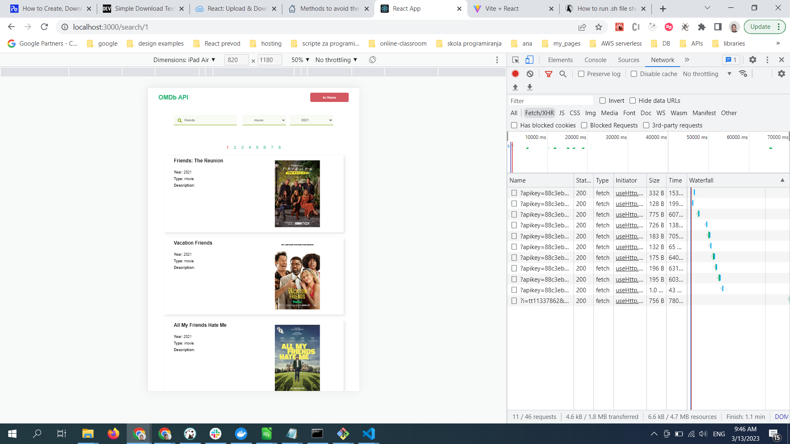
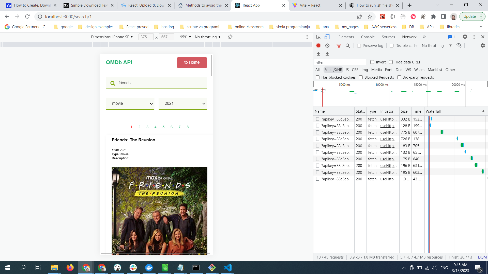
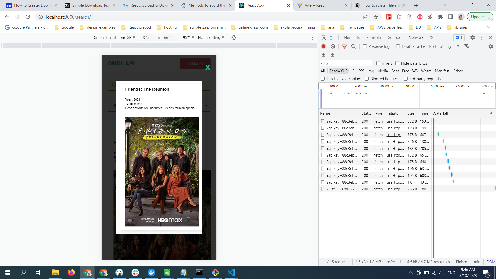
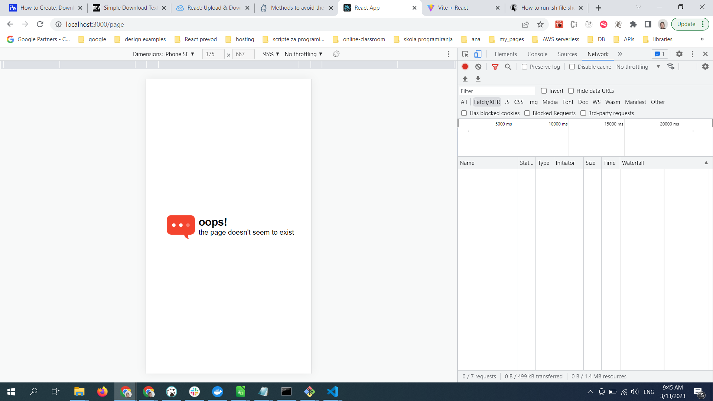

# Tatjana Marković Spartan API 

## Table of contents

  - [Instruction](#instruction)
  - [Overview](#overview)
  - [Built with](#built-with)
  - [Links](#links)
  - [Screenshot](#screenshot)
  - [Author](#author)

## Instruction:
1. Download project from - GitHub - [youtube-api](https://github.com/tatjama/spartan) 
2. Install packages with 
    npm install
3. Create .env fille with Api key and API base_url (Register on OMDB Api and get API key)

### Frontend React
1. run server in development mode with
    npm start
2. find it on
    http://localhost:3000

### Cypress
1. open second terminal and start e2e tests with
    npx cypress open
2. choose e2e testing
3. start e2e testing in Chrome
4. in SPECS choose e2e test

## Overview

1. Bash / Git
    a. You can download bash script as .txt, .sh or .json file. 
    b. You need to save that file in the folder where you want to start script with .sh extension
    c. WINDOWS 
        1.Open cmd in that folder
        2. find file with
            dir
        3. start script with
            git_bash.sh + ENTER
        4. check result with
            dir
        5. check echo with
            new_file.txt
    d. LINUX / BASH
        1. Open bash in that folder
        2. find file with
            ls
        3. start script with
            sh git_bash.sh + ENTER
        4. check result with
            ls
        5. open file
            nano new_file.txt
        
2. React
    OMDb Api is a web application that will allow the user to search for any video.
    The results will be displayed when the user writes to the search input or changes type (live search) or year. 
    In the list of results, you can click on the one result that opens the details of the result when clicked.

3. JavaScript
    Result is shown on the Home page
## Build with 
    1. React.js
    2. StyledComponents
    3. ReactRouterDom
    4. ReactLoaderSpinner

## Links

- GitHub - [spartan-api](https://github.com/tatjama/spartan)
- Live - [spartan-api]()

### Screenshot
;

## Author
- Website - [Tatjana Markovic](https://my-react-portfolio-tatjana.vercel.app/)
- LinkedIn - [Tatjana Marković](https://www.linkedin.com/in/tatjana-markovi%C4%87-919501189/)
- GitHub - [tatjama](https://github.com/tatjama)

